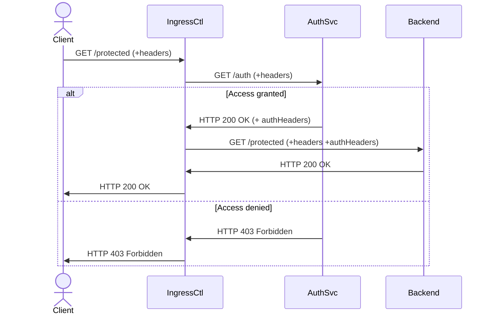

# auth-svc

Service that checks if username stored in incoming bearer token comes from
permitted IP address stored in X-Client-Ip header.

## How does it work?

Ingress controller accepts annotation on an Ingress resource and will use that url
for check if request is authorized.

The authorization server will receive the request with the original request headers (including the `authorization` header) and with these headers added:

|Header|Example value|Meaning|
|-------|--------------|---------|
|`x-request-id`|`1aeef2c74c0d7905d0d736276c3d99b2`|Randomly generated unique request id|
|`x-original-url`|`http://example.com/headers`|Original URL as received by ingress controller|
|`x-original-method`|`GET`|Original request method|
|`x-sent-from`|`nginx-ingress-controller`|Source of the auth request, hard-coded value|
|`x-real-ip`|`172.18.0.1`|Client IP, as sent by load balancer|
|`x-forwarded-for`|`172.18.0.1`|XFF header, set by ingress controller, may contain more addresses depending on `compute-full-forwarded-for`|
|`x-auth-request-redirect`|`/headers`|Configurable by `nginx.ingress.kubernetes.io/auth-request-redirect` annotation|

The whole definition how the auth request is assembled can be found [here](https://github.com/kubernetes/ingress-nginx/blob/73622882070fb459f7bf0b63186416be46852043/rootfs/etc/nginx/template/nginx.tmpl#L967-L1084).

For us, it's important `authorization` header (if present), and `x-real-ip`.

